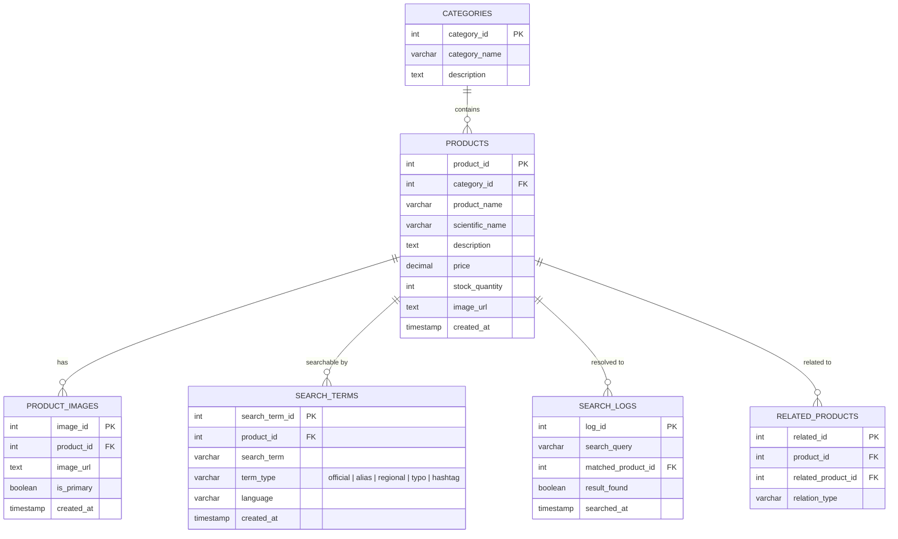

# ER Diagram (Version 1)

This renders automatically on GitHub — no image tool needed. Matches the schema in `database/schema.sql` and is documented in detail in `docs/database_design.md`.

## Notes on relationships

- **CATEGORIES → PRODUCTS**: one category holds many products.
- **PRODUCTS → SEARCH_TERMS**: the core relationship — one product has many searchable names (official, alias, regional, typo, hashtag), which is what enables fuzzy/multilingual search without a single fixed product title.
- **PRODUCTS → SEARCH_LOGS**: every search a customer runs is logged, optionally resolving to a product. `result_found = false` rows are the signal for missing aliases.
- **PRODUCTS → RELATED_PRODUCTS**: self-referencing — powers fallback suggestions when a search doesn't resolve.
- **PRODUCTS → PRODUCT_IMAGES**: one product, many images — needed for future image-based search (CLIP embeddings, planned per `docs/architecture.md`).
